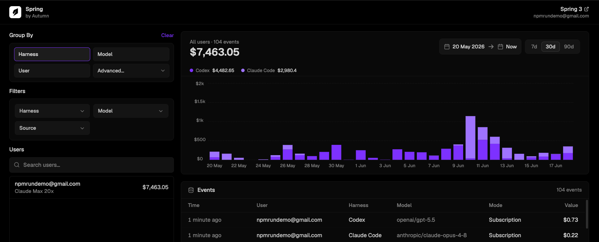

# Summer

Summer is a local, open-source tool for AI-coding **usage and spend**, built by
[Autumn](https://useautumn.com). Per developer, across **Claude Code** and **Codex**, it
answers: how much is each engineer using, on what models, and what's it worth?



## Install

```bash
bun -g install @useautumn/summer
```

## Quick start

```bash
summer start
```

`summer start` does everything first-time setup needs:

1. **Logs you in** to Autumn (opens a browser) if you aren't already.
2. **Sets up your Autumn org** — confirms which org to use and creates Summer's usage feature there.
3. **Offers to backfill** your existing Claude Code + Codex history so the dashboard isn't empty on day one.

It then points Claude Code's and Codex's telemetry at a local receiver and installs a small
**autostart service** (launchd on macOS, systemd `--user` on Linux) so Summer keeps running
across logouts and reboots. Just use your tools as usual — usage is tracked automatically.
(Pass `--no-service` to run as a plain background process instead.)

```bash
summer dash      # open the dashboard (alias: summer dashboard)
summer stop      # stop and restore your Claude Code / Codex settings
```

## Dashboard

`summer dash` serves a local UI (and opens it in your browser): a usage chart you can
**group by** harness / model / user / billing mode, **filter** by any property, search
**per-developer** usage, and inspect the raw **events**.

## Invite your team

Summer rolls up usage across everyone in your Autumn org.

1. Open your Autumn org settings →
   [**Organization → invite members**](https://app.useautumn.com/sandbox/settings?tab=organization).
2. Invite a teammate by email.
3. They accept the invite in Autumn, then run `summer start` themselves.

That's it — their usage shows up alongside yours in the dashboard.

## Commands

| Command | What it does |
| --- | --- |
| `summer start` | Set up (if needed) and start tracking. |
| `summer dash` | Open the usage dashboard (alias: `dashboard`). |
| `summer backfill` | Import historical Claude Code + Codex usage (backdated). |
| `summer report` | Usage rollup in the terminal. |
| `summer status` | Auth + local state. |
| `summer stop` | Stop and restore harness settings (also removes autostart). |
| `summer service install` / `uninstall` / `status` | Manage on-boot autostart. |
| `summer login` / `logout` | Manage Autumn auth. |

## How it works

Each developer is an Autumn customer. Token usage is captured locally via OpenTelemetry
(Claude Code) and session logs (Codex), priced by Autumn via
[Models.dev](https://models.dev), and recorded as **`usage_in_usd`** with properties like
`harness`, `model`, `user_email`, and `billing_mode` (`subscription` = value covered by
your plan, `api` = real pay-per-token spend).
